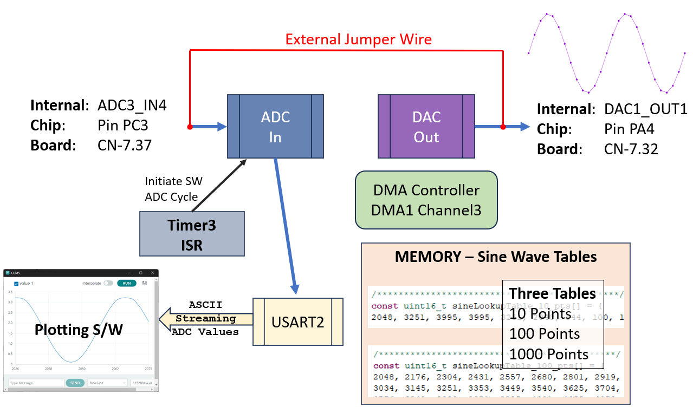
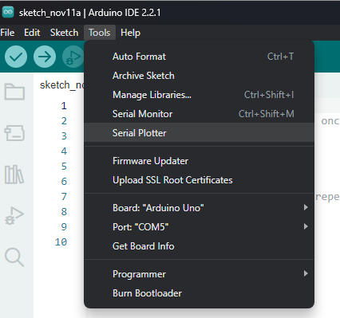
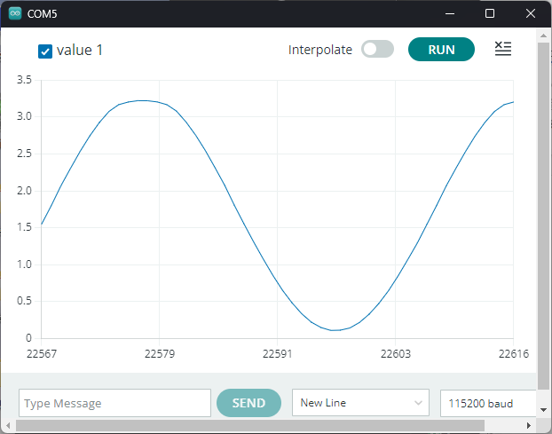
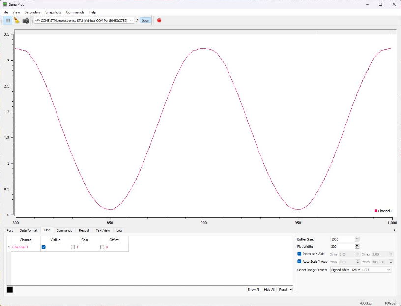
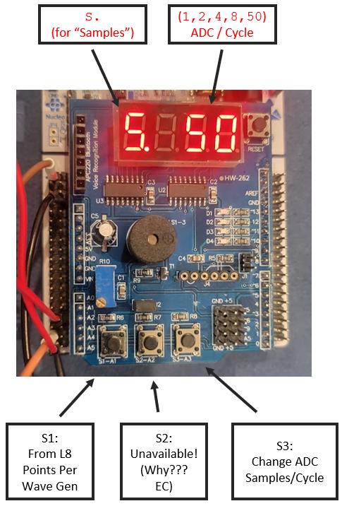
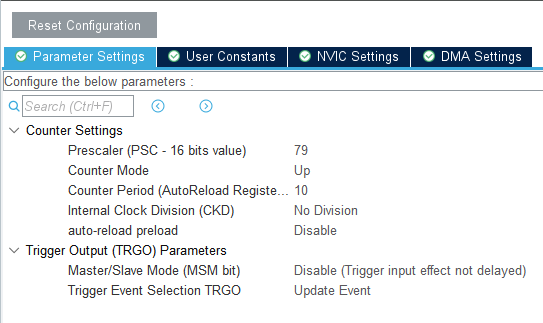
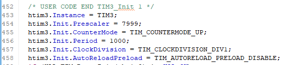
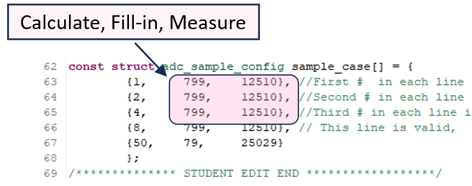
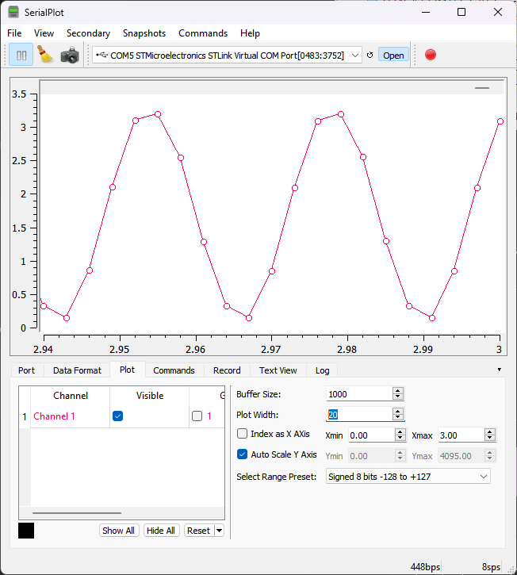

# ECEN-361 Lab-08-Part2: ADC / Sampling

## Introduction and Objectives of the Lab

* **Part 1:** Understand ADC operations & triggering control via timer

* **Part 2:** Observe the effects of sampling rate on an ADC, via a Serial-port-based graphical tool

For each of the parts, follow the instructions, then fill in answers to the questions. Expected answers are indicated with <mark>[*answer here*]</mark>.

## Overview of System

This project continues from Lab-08, where the Nucleo-64 was used to create various quality sine-wave outputs via a DMA-controlled DAC, reading from tables. This project will use that same portion of the lab to provide an on-board sine wave that will then be fed back into the ADC for this portion of the lab. For this lab, the wire below will be required, as the electric signal is driven out from PA4 and sampled in with PC3:

## Part 1: Modifying the ADC Sample Rate and seeing

1. Run the code.
   
   Your board should show “1000” on the 7-seg display
   
   The 7-Seg LEDs indicate which of the points-per-cycle table is being used to output the DAC waveform: 10, 100, 1000. These values can be cycled by pressing S1. For this lab, there will be no need (maybe *Extra Credit*) to use any of the other values generated by our DAC!

2. Connect the DAC out to the ADC in
   
   
   
   You’ll need a single jumper (from your ECEN-106 kits or available during lab time).
   
   Use a female-to-female jumper to connect the DAC-out to the ADC-in  
   (CN-7.32 CN-7.37).

3. Plot the sampled signals from the ADC
   
   For this lab, you’ll be looking at the sampled output of the ADC, by using software that reads ASCII values of data points and plots them. There are several free solutions. The following two have been tried and work equally well:
   
   **Option 1:** Arduino Serial Plotter
   
   If you have already used and still have Arduino installed, this is an easy solution. Open Arduino, set the correct COM Port, and open the Tools/Serial Plotter:
      
   
   **Option 2:** SerialPlot ([LINK HERE](https://hackaday.io/project/5334-serialplot-realtime-plotting-software))
   
   If you don’t have Arduino or want to use something different (like for Mac or Linux), SerialPlot works very well. Install from the link above, connect the correct COM port, and set the “Plot Width” (Plot tab) to about 100 and the Data Format to ASCII (Data Format tab).

Either of these graphing tools should instantly be showing the output of the ADC:

**SerialPlot**

**Arduino Serial Plotter**
 

*For the lab, “Serial Plot” will be shown, but results are very similar.*

Note that you can see the data on the COM port as well by opening a serial terminal emulator, like PuTTY or Tera Term. You *cannot* connect both PuTTY AND the plotting program at the same time.

4. Sample Rate with button: S3
   
   The on-chip SineWave Generator (at 1000pts/period) is set to output exactly 1Hz. 
   
   In this lab, we will change the samples per period. The sine wave source (1Hz) will stay constant, but we will sample at [1, 2, 4, 8, and 50 samples/period]. The sample rate will change via the S3 button. Pressing S3 will then change the display to show the Samples/Cycle, as “S. x” where x is the samples/period. Press S3 and see that it cycles:
   
   
   
   With the SerialPlotter screen connected and working, press S3 and cycle thru the samples. NOTE – Only the “8” changes things until you change the code (later in the lab)!
   
   Computing and modifying the values necessary to create the sample rate is the exercise today.

5. Set up the Logic Analyzer
   
   It will help to see things. Connect the following probes on the Saleae:
   
   Channel-A0 Analog (rename to “DAC-OUT”) to the jumpered wire (**only** if using a Saleae logic analyzer)
   
   Channel D1 Digital (rename to “Period_Start”) to PC10 (top left CN7.1)
   
   Channel D2 Digital (rename to “ADC_Sample”) to PC2 (CN7.35)
   
   
   
   - **Period Start**: A GPIO pulse from the DAC at the beginning of the SineWave out (1000 pts)
   - **ADC_Sample**: A GPIO pulse out each time an ADC sample is taken
   - **DAC_OUT**: The analog wave out and going back in to be sampled

As can be seen – with 50-samples per cycle, there are 50 pulses per period.

6. Modify the code to change ADC Samples
   
   ADC samples can be ‘triggered’ by various means: An external clock input, one of the internal Timer, or manually by a S/W call. Because we want to do some processing directly, we are using a Timer with the Timers ISR to manually initiate a S/W ADC. We will adjust how often that Timer ISR is called, by adjusting the parameters of the timer. Recall that these can be set via the GUI, or with register writes:
   
   
   
   
   
   The S3 button simply changes the parameters to Timer3. These parameters have been stored in **main.c**, in a **struct** for convenience and readability.
   
   The respective parameters are then used by the S3_Button ISR to change the operation of the Timer so that the ADC sample timing changes.

## Questions (3 pts)

* Modify main.c to change the values here.
  
   
  
   Measure your results with the analyzer (ADC_Sample pin, time between samples and total number of samples / cycle). *(I’ll run your committed code when grading)*
  
   Make note of what values you changed here:
  
  | Sample Rate | Prescaler Value              | Period                       |
  | ----------- | ---------------------------- | ---------------------------- |
  | 1           | <mark>[*answer here*]</mark> | <mark>[*answer here*]</mark> |
  | 2           | <mark>[*answer here*]</mark> | <mark>[*answer here*]</mark> |
  | 4           | <mark>[*answer here*]</mark> | <mark>[*answer here*]</mark> |
  
  What equation did you use to get these values?
  
  <mark>[*answer here*]</mark>

## Part 2: Effect of Sampling Rate

Now that the sample rate is known and selectable, we’ll look at the results via the SerialPlotter.

You should see varying accuracies of the re-created waveform. Here’s the 8 samples/cycle:

## Questions (7 pts)

* Why did the “Period” on the timer need to be slightly adjusted from your calculation?  Why didn’t the exact number just work?
  
  <mark>[*answer here*]</mark>

* In the current approach, could the serial port Baud rate affect the ADC Sample Rate?
  
  <mark>[*answer here*]</mark>

* How could you change the code/structure of the ADC sampling, currently controlled by the timer ISR, to make it require less empirical adjustment?
  
  <mark>[*answer here*]</mark>

* Take/Paste screenshots from the output of your SerialPlotter screen showing the resulting waveformsfrom the ADC for 1, 2, 4, 8, and 50 samples per cycle.
  
  <mark>[*screenshot for 1 sample per cycle here*]</mark>
  <mark>[*screenshot for 2 sample per cycle here*]</mark>
  <mark>[*screenshot for 4 sample per cycle here*]</mark>
  <mark>[*screenshot for 8 sample per cycle here*]</mark>
  <mark>[*screenshot for 50 sample per cycle here*]</mark>

* What do you see about the 1 sample per cycle plot/results?
  
  <mark>[*answer here*]</mark>
  
  Relationship to the Nyquist Sampling Theorem (LINK HERE if you forgot)?  
  
  <mark>[*answer here*]</mark>

* Practically, is 2 samples per cycle adequate? Could you see aliasing in your 2 samples per cycle plot?
  
  <mark>[*answer here*]</mark>

## Extra Credit (5 pts maximum, points as indicated)

* Button S2 was not available for this lab.  Why not? (1 pt)
  
  <mark>[*answer here*]</mark>

* The serial port was done by using the printf() function.  Change it to be a DMA buffer out instead. (5 pts)
  
  <mark>[*answer here*]</mark>

* Use another of the timers, set it to fine resolution (µSecs), and trigger it on each start of the sample so you can automatically read how long between samples (5 pts)
  
  <mark>[*answer here*]</mark>

* Instead of using a timer’s ISR to launch a manual S/W-triggered ADC, configure the ADC3 to use the “EXTI Conversion Trigger” instead to automatically (H/W triggered) time the samples. Make any comments about it here:  (5 pts)
  
  <mark>[*answer here*]</mark>
